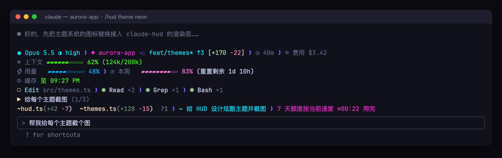
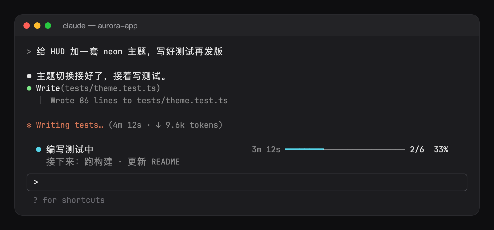
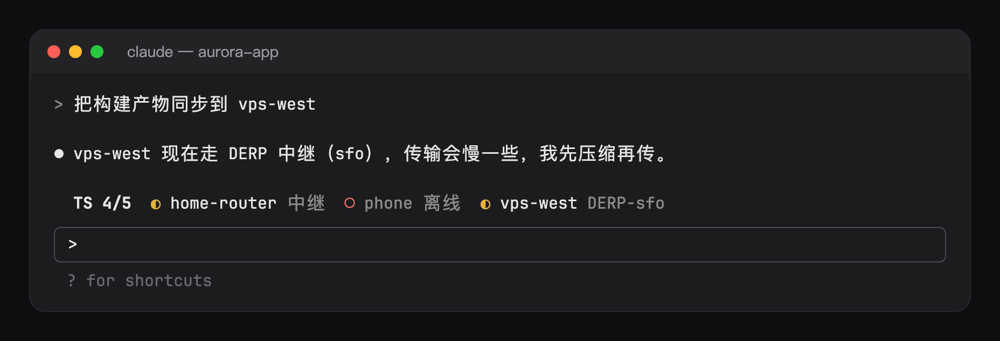
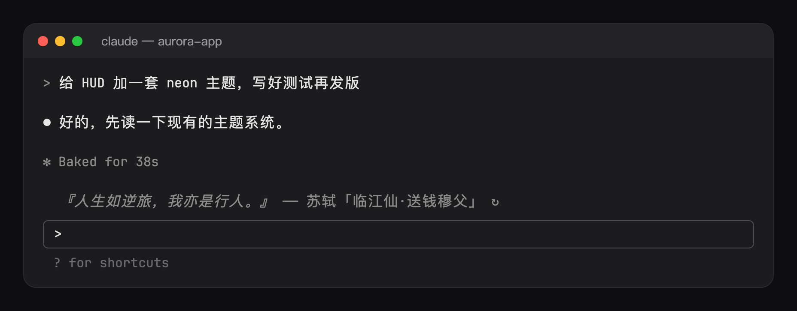

# hoobnn-agent-mods: Claude Code mods (statusline HUD, task progress bar, spinner animations)

[简体中文](README.md) · **English**

Six mods that make Claude Code's terminal more useful and more fun: a statusline HUD, a task progress bar, a turn receipt, spinner animations with a pet, a Tailscale node band and a Hitokoto quote band. Each installs on its own, works out of the box and keeps its settings in `/config`. The repo also holds extensions for other coding-agent harnesses, one folder per harness.

| Folder | Harness | What goes there |
| --- | --- | --- |
| `claude-code/` | [Claude Code](https://code.claude.com) | Mods (function-hook plugins); each subfolder loads with `claude --plugin-dir`, except `kit/`, the code they share |
| `pi/` | [pi](https://github.com/badlogic/pi-mono) | Extensions |
| `deepseek/` | [DeepSeek Harness](https://github.com/deepseek-ai/deepseek-harness) | `dsh` plugins |
| `shared/` | any | Logic more than one port uses |
| `scripts/` | | Checks and local install helpers |

## Claude Code mods

| Mod | What it does |
| --- | --- |
| [`hud`](claude-code/hud/README.en.md) | A statusline HUD: model, git, context, usage, tools and todos at a glance, with quota alerts, a usage forecast, a daily budget, a task summary, a `/hud detail` pane and 12 themes to switch live |
| [`ts-band`](claude-code/ts-band/README.en.md) | Tailscale node status: one small mark while every node is direct, the relayed or offline ones listed otherwise, with a toast when a node comes up or goes down |
| [`hitokoto`](claude-code/hitokoto/README.en.md) | A [Hitokoto (一言)](https://hitokoto.cn) quote and its source above the prompt, refreshed on a timer, once a day, per session or per prompt |
| [`spinner`](claude-code/spinner/README.en.md) | Animations and a companion pet: pixel-art scenes (a shoot-em-up, Clawd, a dot-eater, a rainbow cat, a spectrum of the sound your Mac plays; 15 themes), a pet that follows what Claude does and levels up, and confetti when a turn ends |
| [`todo-bar`](claude-code/todo-bar/README.en.md) | A task progress bar: the task running, how long it has run and how much is done; reads the TodoWrite / Task tools' results, no tokens |
| [`receipt`](claude-code/receipt/README.en.md) | A turn receipt: one row saying what the turn changed (files, lines), ran and how much failed, plus an alert when Claude goes in circles; no tokens |

Install them from this repo's marketplace:

```sh
claude plugin marketplace add hoobnn/hoobnn-agent-mods
claude plugin install hud@hoobnn-agent-mods
claude plugin install ts-band@hoobnn-agent-mods
claude plugin install hitokoto@hoobnn-agent-mods
claude plugin install spinner@hoobnn-agent-mods
claude plugin install todo-bar@hoobnn-agent-mods
claude plugin install receipt@hoobnn-agent-mods
```

Options (`hud`'s `position`, `theme`, `dailyBudgetUsd` and `summaryEveryTurns`, `ts-band`'s `nodes` and `hideOffline`, `hitokoto`'s `refreshMode` and `categories`, `spinner`'s `theme`, `stage`, `celebrate` and `companion`, …) are rows in `/config`, or `pluginConfigs` in `~/.claude/settings.json`. `/config` is the one place a mod's settings live: what a slash command changes (`/hud theme neon`, `/ts off`, `/spinner stage off`) it writes there, and every mod has a `visible` row that `/hud`, `/ts`, `/hitokoto`, `/spinner`, `/todos` and `/receipt` `off` / `on` set. Each mod's folder has its own README with the details.

`spinner` at work (the `clawd` theme through a turn, the companion's bubble following the tools, then the finale; every theme's GIF is in [`claude-code/spinner`](claude-code/spinner/README.en.md)):


The other mods (each shot is rendered from what the mod itself draws):

| `hud` (the `neon` theme; all twelve in [gallery.png](claude-code/hud/assets/themes/gallery.png)) |
| --- |
|  |

| `todo-bar` | `receipt` |
| --- | --- |
|  |  |
| `ts-band` | `hitokoto` |
|  |  |

All the mods speak English, Simplified Chinese, Traditional Chinese, Japanese, Korean, Spanish, French, German, Brazilian Portuguese and Russian. `hud` follows `language` in claude-hud's config; `ts-band`, `hitokoto`, `spinner`, `todo-bar` and `receipt` each have a `language` option whose default, `auto`, follows Claude Code's `language` setting, then the system locale, then English.

### Developing

- Run a working copy over the installed one: `claude --plugin-dir claude-code/<mod>`. It's watched, so a save reloads the hooks module.
- Each mod reads its options once in `hooks/config.ts` (a typed `Config`); `hooks/register.tsx` holds the hooks, and whatever calls `$` (the engine follows `$` only within that file).
- Code the mods share lives in `claude-code/kit/` (language, option readers, band stacking, `/config` writes). An installed mod reaches nothing outside its folder, so `scripts/sync-kit.sh` copies the kit files each mod imports into its `hooks/kit/`: edit `claude-code/kit/`, then run it; `scripts/check.sh` fails on a stale copy.
- `scripts/check.sh` checks the kit copies, then validates, tests and type-checks every mod, and prints each mod's reach as [awesome-claude-code-mods](https://github.com/karanb192/awesome-claude-code-mods) grades it (L0 draws, L1 reads, L2 writes or runs, L3 network); a mod past its level in `scripts/reach.txt` fails. The mod API is early access, so run it after a Claude Code update too. `tsc` needs the types Claude Code puts in `.claude-plugin/types/` the first time it loads the mod.
- `bun scripts/spinner-shots.ts` renders `spinner`'s GIFs and stills again from its own frame tables (needs ffmpeg and Playwright's Chromium).
- `bun scripts/mod-shots.ts [<mod> ...]` renders the previews of `ts-band`, `hitokoto`, `todo-bar` and `receipt` again: it drops `scripts/shots/<mod>.tsx` into the mod's `tests/` for one run, takes the tree the band really drew, and shoots it in a terminal window (needs Playwright's Chromium).
- Release: bump `version` in the mod's `plugin.json` and its entry in `.claude-plugin/marketplace.json`, commit, then `claude plugin tag claude-code/<mod> --push` (tags look like `<mod>--v<version>`). Installs pick it up with `claude plugin marketplace update hoobnn-agent-mods && claude plugin update <mod>@hoobnn-agent-mods`.

## License

MIT. `claude-code/hud/hooks/hud` is claude-hud's source under its own MIT license (`claude-code/hud/LICENSE.claude-hud`).
