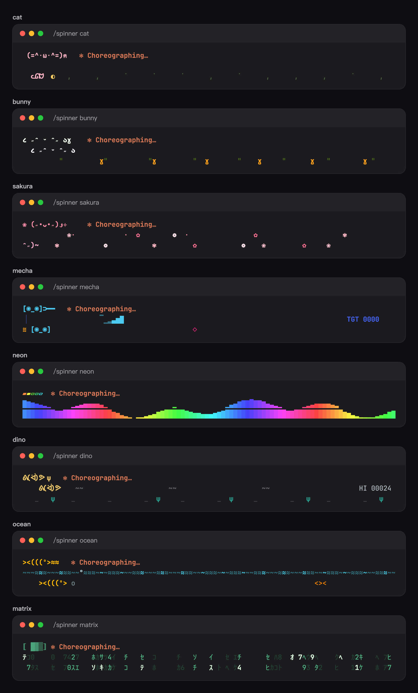

# hoobnn-agent-mods：Claude Code 状态栏 HUD 与插件

**简体中文** · [English](README.en.md)

我给几个编程 Agent 工具写的 mod、扩展和插件，按工具分目录放。目前能用的主要是 Claude Code 的四个 mod：状态栏 HUD、Tailscale 节点状态条、一言和运行动画。

| 目录 | 对应工具 | 放什么 |
| --- | --- | --- |
| `claude-code/` | [Claude Code](https://code.claude.com) | mod（函数钩子插件），每个子目录都能用 `claude --plugin-dir` 单独加载 |
| `pi/` | [pi](https://github.com/badlogic/pi-mono) | 扩展 |
| `deepseek/` | [DeepSeek Harness](https://github.com/deepseek-ai/deepseek-harness) | `dsh` 插件 |
| `shared/` | 不限 | 多个工具的移植版都要用到的逻辑 |
| `scripts/` | | 检查脚本和本地安装辅助脚本 |

## Claude Code mod

| Mod | 作用 |
| --- | --- |
| [`hud`](claude-code/hud) | 把 [claude-hud](https://github.com/jarrodwatts/claude-hud) 0.10.0 改成 mod，显示模型、项目、git、上下文、用量、工具、子代理和待办，可以放在输入框上方或下方。另外加了：长任务结束提醒、上下文和额度预警、用量耗尽预测、每日预算、近 7 天花费、未提交改动提醒、一行任务摘要，`/hud detail` 详情面板，以及 12 套可随时切换的主题（科技霓虹、彩虹渐变、emoji、樱花 / 猫咪 / 机甲 / 热血等带颜文字看板娘的动漫风、Nerd Font 与 powerline） |
| [`ts-band`](claude-code/ts-band) | 在输入框上方显示 Tailscale 节点状态：全部直连时只占一个短标记，有节点走中继 / DERP（黄）或离线（红）时只列出这些节点；节点上线或掉线时弹提示 |
| [`hitokoto`](claude-code/hitokoto) | 在输入框上方显示一句[一言](https://hitokoto.cn)，可以定时换、每天一句、每个会话一句或每次发消息换一句 |
| [`spinner`](claude-code/spinner) | AI 运行时的动画：Spinner 行前面加一个会按思考 / 调工具 / 输出切换动作的小角色，输入框上方放两行动画小剧场（猫追毛线球、兔子跳胡萝卜、樱花飘落、机甲打靶、霓虹频谱、自动跳仙人掌的小恐龙、小鱼吐泡泡、黑客帝国字符雨），一轮结束时放 3 秒彩带并显示用时；8 套主题，`/spinner` 随时切换和预览 |

从本仓库的插件市场安装：

```sh
claude plugin marketplace add hoobnn/hoobnn-agent-mods
claude plugin install hud@hoobnn-agent-mods
claude plugin install ts-band@hoobnn-agent-mods
claude plugin install hitokoto@hoobnn-agent-mods
claude plugin install spinner@hoobnn-agent-mods
```

选项（`hud` 的 `position`、`theme`、`dailyBudgetUsd`、`summaryEveryTurns`，`ts-band` 的 `nodes`、`hideOffline`，`hitokoto` 的 `refreshMode`、`categories`，`spinner` 的 `theme`、`stage`、`celebrate` 等）都能在 `/config` 里改，也可以写在 `~/.claude/settings.json` 的 `pluginConfigs` 里。每个 mod 的完整说明见各自目录下的 README（英文）。

`spinner` 的效果（`cat` 主题跑完一轮再放庆祝动画；8 套主题的动图见 [`claude-code/spinner`](claude-code/spinner)）：




四个 mod 都支持英语、简体中文、繁体中文、日语、韩语、西班牙语、法语、德语、巴西葡萄牙语和俄语。`hud` 跟随 claude-hud 配置里的 `language`；`ts-band`、`hitokoto` 和 `spinner` 有各自的 `language` 选项，默认 `auto`，依次跟随 Claude Code 的 `language` 设置、系统语言环境，都没有时用英语。

### 开发

- 用工作副本覆盖已安装的版本：`claude --plugin-dir claude-code/<mod>`。会监听文件，保存后钩子模块自动重新加载。
- `ts-band`、`hitokoto` 和 `spinner` 各自的 `hooks/i18n.ts` 里有同一份语言解析逻辑（安装后的 mod 读不到自己目录以外的文件），改一处要同步其余两处。
- `scripts/check.sh` 会校验、测试并类型检查所有 mod。mod API 还在早期阶段，Claude Code 升级后也跑一遍。`tsc` 需要的类型文件由 Claude Code 在第一次加载 mod 时放进 `.claude-plugin/types/`。
- `bun scripts/spinner-shots.ts` 用 `spinner` 自己的帧表重新渲染它的 GIF 和静态图（需要 ffmpeg 和 Playwright 的 Chromium）。
- 发布：把 mod 的 `plugin.json` 和 `.claude-plugin/marketplace.json` 里对应条目的 `version` 改掉，提交，然后执行 `claude plugin tag claude-code/<mod> --push`（tag 格式是 `<mod>--v<version>`）。已安装的用户执行 `claude plugin marketplace update hoobnn-agent-mods && claude plugin update <mod>@hoobnn-agent-mods` 更新。

## 许可

MIT。`claude-code/hud/hooks/hud` 是 claude-hud 的源码，沿用它自己的 MIT 许可（见 `claude-code/hud/LICENSE.claude-hud`）。
