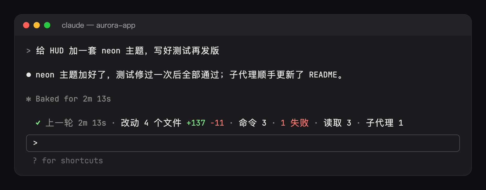

# receipt

What each turn did, in one row above the prompt once it ends:



```
✓ 上一轮 2m 13s · 改动 3 个文件 +48 −12 · 命令 6 · 1 失败 · 读取 14 · 子代理 1 · ⚠ 1
```

How the turn ended (`✓` answered, `◼` interrupted, `✗` an error), how long it took, then only the counts that have something to say: the files it changed with the lines added and removed, the commands it ran and how many failed, the reads (`Read`, `Grep`, `Glob`), the subagents it started and the warnings it raised. A subagent's calls count toward the turn that started it. A turn that used no tool leaves no receipt, and the row leaves when the next turn starts.

`/receipt` lists it in full: every file with its lines (`new` for a file the turn made), every failed command, every warning. `/receipt off` and `/receipt on` hide or show the band by writing the `visible` option, so `/config` shows the choice and it is kept across sessions. The band steps aside while a `/` or `@` picker is open, as the other mods' bands do.

## Going in circles

While the turn runs, a toast when the main thread:

- runs the same call and it fails `repeatFailures` times in a row (default 3) with nothing changed in between. An edit, or a shell command the tool did not hold read-only (`sed -i`, `npm install`), is work, not a loop, and starts the count over; `cat` or `ls` does not.
- edits a file back to what an earlier edit took out of it, the `flipFlops`th time (default 2).

Each fires once per streak; 0 turns a rule off. The warnings stay on the receipt (`⚠ 1`) and in `/receipt`.

It costs no tokens. It reads the turn's tool calls after they have run (Edit, Write and NotebookEdit for the files, with git's line counts when the result has them, else the patch's; Bash for the commands; a call that answered an error for the failures). It registers no tool, adds nothing to the system prompt, and refuses or holds no call; a refused call counts for nothing.

Options: `visible`, `repeatFailures`, `flipFlops`.

Language: `language` (`auto`, `en`, `zh-Hans`, `zh-Hant`, `ja`, `ko`, `es`, `fr`, `de`, `pt-BR`, `ru`); `auto` follows Claude Code's `language` setting, then the system locale (`LC_ALL`, `LC_MESSAGES`, `LANG`), then English.

## Layout

- `hooks/register.tsx`: the hooks: the session's start (language, `/receipt`), the turn's start and end, the tool calls it reads, the command and the band.
- `hooks/ledger.ts`: the receipt and the loop rules, built from what each call carried.
- `hooks/config.ts`: the options, read once into a typed `Config`.
- `hooks/i18n.ts`: the messages.
- `hooks/kit/`: copies of `claude-code/kit` (language, option readers, band stacking, `/config` writes); edit the source and run `scripts/sync-kit.sh`.
