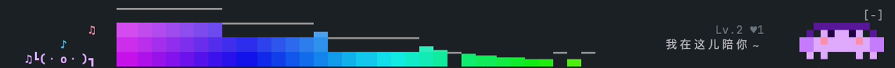
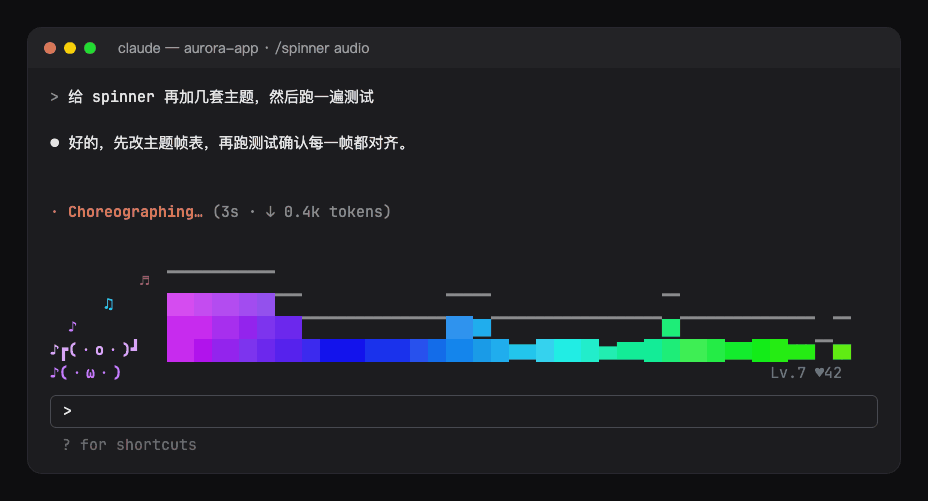

<div align="center">

# spinner: animations and a companion pet for Claude Code

[简体中文](README.md) · **English**

</div>

While Claude works, a little show plays above the prompt: a pixel-art shoot-em-up, Claude's mascot Clawd, a dot-eater, a rainbow cat and more, with a pet that changes pose as Claude thinks, runs tools and replies. When the turn ends, a burst of confetti with the time it took. Fifteen themes, switched any time, one of them a visualizer of whatever your computer is playing.


## Features

- Stage: an animated scene in the band above the prompt while a turn runs. Other mods' bands (hud, ts-band, hitokoto) stay beneath it.
- Companion: a pet in the spirit of Codex's pets, with poses for thinking, using tools, responding and waiting. Its bubble says only what Claude Code's own spinner line doesn't: the tool running (`Bash: npm test`, `Edit: themes.ts`) or a permission prompt waiting on you; while the model thinks it just looks busy. Parallel subagents are counted (`Agent ×3`), a single one shows its task. When Claude runs tests or commits, it says so for a few seconds (tests passed, tests failed, committed).
- Growth: the pet stays between turns (done, interrupted, failed; dozing after five quiet minutes). Every finished turn, passing test run and commit earns it experience toward the next level (`Lv.4`); a click on it or `/spinner pet` pats it (`♥12`, hearts float up). Its level and affection are kept across sessions, and sessions running side by side all raise the one pet.
- Mascot on the spinner line: with the companion turned off, the mascot moves in front of Claude Code's own spinner line instead (`[◉_◉]⊃━━ ✢ Choreographing… (4s · ↓ 14 tokens)`), whose word, elapsed time and tokens stay as they are. One mascot shows at a time.
- Finale: for three seconds after a turn ends, confetti bursts around the mascot with the time the turn took (`(=^▽^=)ﾉ  Done · 12s`); an interrupted turn gets a sad face, a failed one a glitch.
- Reduced motion: with `reducedMotion` on, every animation is drawn as a single still frame that still changes with what Claude is doing.

## Themes

Pixel-art scenes, three rows of half-block pixels:

- `clawd`: Claude Code's own mascot strolls by, stops to work with the Claude spark spinning beside him, types on a laptop while a tool runs and raises a `?` when you're asked.
- `thunder`: a side-scrolling shoot-em-up: a fighter auto-aims and fires at waves of invaders, explosions and a running score; the waves come faster while tools run.
- `chomp`: a dot-eating hero chased by four ghosts until it swallows the power pellet.
- `sparky`: an electric mouse dashing through, cheeks crackling and thunderbolts striking while tools run.
- `bluecat`: a blue robot cat on a bamboo-copter, gadgets tumbling out of its pocket while tools run.
- `nyan`: a pop-tart cat on a rainbow trail across the stars.

Character scenes, two rows: `cat`, `bunny`, `sakura`, `mecha`, `neon`, `dino`, `ocean`, `matrix`. Or `random` for a new one each session.

Sound, four rows: `audio` turns the sound your Mac is playing (music, a video, a call) into a live spectrum, a bar per band with its peak falling above it, while a dancer on the left moves on the beat and the companion wears big headphones. While it plays, the band stays up between turns too; a few seconds after it stops, the band folds away. `random` never draws it: pick it by name.



`audio` needs macOS 14.2 or later and `swiftc` (Xcode Command Line Tools: `xcode-select --install`). On first use the mod builds a small helper from `hooks/audio-tap.swift` (about two seconds) and runs it while the theme shows: it taps the system output through Core Audio and hands the mod only band levels, twenty times a second; no sound is kept, written or sent. macOS asks once to let your terminal record system audio; denied, the bars stay flat. Without a tap (another OS, the desktop app, a failed build) the band shows a sleeping dancer and `/spinner` says why. Previews and the GIF below play a made-up signal.

| | |
| --- | --- |
| `clawd`<br> | `thunder`<br> |
| `chomp`<br> | `sparky`<br> |
| `bluecat`<br> | `nyan`<br> |
| `cat`<br> | `bunny`<br> |
| `sakura`<br> | `mecha`<br> |
| `neon`<br> | `dino`<br> |
| `ocean`<br> | `matrix`<br> |
| `audio`<br> | |

Every theme's mascot, stage and companion in one still: [assets/gallery.png](assets/gallery.png); a still per theme is at `assets/<theme>.png`.

`chomp`, `sparky`, `bluecat` and `nyan` are fan-made homages drawn from scratch, under names of their own; `clawd` is drawn as Claude Code draws him on its welcome screen.

## Install

```sh
claude plugin marketplace add hoobnn/hoobnn-agent-mods
claude plugin install spinner@hoobnn-agent-mods
```

The pixel scenes need a terminal with true color (Ghostty, iTerm2, WezTerm, kitty and the like).

## Commands

- `/spinner`: shows the current theme, the companion's level and affection, and the theme list.
- `/spinner <theme>`, `/spinner random`: switch the theme at once; `/spinner theme` asks which in a dialog (random and three themes offered, any other typed under Other).
- `/spinner preview [theme]`: plays a scene above the prompt for eight seconds.
- `/spinner pet`: pats the companion.
- `/spinner off` / `on`: turns all the animations off or on; `/spinner stage off` / `on` the scene alone; `/spinner companion off` / `on` the companion alone.

What these commands change is written back to `/config`, kept for later sessions and applied at once. With `random`, a reload in the same session keeps the theme it drew.

## Options

Set them in `/config`, or under `pluginConfigs` in `~/.claude/settings.json`:

| Option | What it does | Default |
| --- | --- | --- |
| `visible` | The switch for all the animations (`/spinner off` / `on`, or the Spinner button in the prompt footer) | on |
| `footerButton` | Show the Spinner toggle button in the prompt footer | on |
| `theme` | The theme | `random` |
| `stage` | The animated scene above the prompt | on |
| `celebrate` | The finale when a turn ends | on |
| `companion` | The companion | on |
| `reducedMotion` | Draw the mascot, the scene and the companion as still pictures that still change with the state | off |
| `language` | Language of `/spinner`'s replies, the companion's bubbles and the finale's label: `auto`, `en`, `zh-Hans`, `zh-Hant`, `ja`, `ko`, `es`, `fr`, `de`, `pt-BR`, `ru` | `auto` |

`auto` follows Claude Code's `language` setting, then the system locale, then English.

While Claude works, the band takes the theme's rows plus one for the companion; between turns, one row. When room runs short the scene steps aside and the companion stays; under three rows or 60 columns the companion shrinks to one row (the mascot, its bubble and its level). The mascot, the stage and the companion draw in the terminal and the desktop app; elsewhere Claude Code's own spinner shows unchanged.

## More mods

[hoobnn-agent-mods](../../README.en.md) also has a statusline HUD (`hud`), a task progress bar (`todo-bar`), a turn receipt (`receipt`), a Tailscale node band (`ts-band`) and a Hitokoto quote band (`hitokoto`).

## Development

- `hooks/register.tsx`: the hooks: the session's start, the turn's events (activity, finale, pet), `/spinner`, the mascot on the spinner line and the band.
- `hooks/config.ts`: the options, read once into a typed `Config`.
- `hooks/command.ts`: `/spinner`'s arguments to what they ask for.
- `hooks/pet.ts`: the companion's level and bubble, tool labels, durations.
- `hooks/themes.ts`, `hooks/cells.ts`: the themes and the cell grid they draw on; `hooks/stage.tsx`, `hooks/sprite.tsx`: the `Client` modules that animate them.
- `hooks/audio.ts`, `hooks/audio-tap.swift`: the `audio` theme's meter (gain, peaks, beats) and the tap it reads; register.tsx builds and runs the tap, and the band asks for levels each frame over `ui.message`.
- `hooks/i18n.ts`: the messages.
- `hooks/kit/`: copies of `claude-code/kit`; edit the source and run `scripts/sync-kit.sh`.
- `scripts/spinner-shots.ts` at the repository's root renders every GIF and still again from `hooks/themes.ts`.
