# spinner

Animations and a companion pet while the model works.

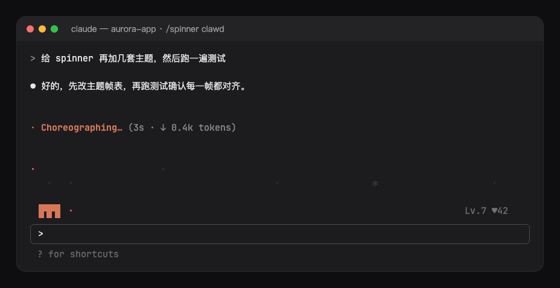

- **Stage**: an animated scene in the band above the prompt while a turn runs. Other mods' bands (hud, ts-band, hitokoto) stay beneath it.
- **Companion**: a pet in a row under the stage, in the spirit of Codex's pets, with poses for thinking, using tools, responding and waiting. Its bubble says only what Claude Code's own spinner line doesn't: the tool running (`Bash: npm test`, `Edit: themes.ts`) or a permission prompt waiting on you; while the model thinks it just looks busy. Parallel subagents are counted (`Agent ×3`), a single one shows its task. When Claude runs tests or commits, it says so for a few seconds (tests passed, tests failed, committed). It stays between turns (done, interrupted, failed; dozing after five quiet minutes), gains a level as turns finish and as tests pass and commits land (`Lv.4`), and a click on the band or `/spinner pet` pats it (`♥12`, hearts float up). Its level and affection are kept across sessions, and sessions running side by side all raise the one pet.
- **Mascot on the spinner line**: with the companion turned off, the mascot moves in front of Claude Code's own spinner line instead (`[◉_◉]⊃━━ ✢ Choreographing… (4s · ↓ 14 tokens)`), whose word, elapsed time and tokens stay as they are. One mascot shows at a time.
- **Finale**: for three seconds after a turn ends, confetti bursts around the mascot with the time the turn took (`(=^▽^=)ﾉ  Done · 12s`); an interrupted turn gets a sad face, a failed one a glitch.

## Themes

Pixel-art scenes, three rows of half-block pixels:

- `clawd`: Claude Code's own mascot strolls by, stops to work with the Claude spark spinning beside him, types on a laptop while a tool runs and raises a `?` when you're asked.
- `thunder`: a side-scrolling shoot-em-up: a fighter auto-aims and fires at waves of invaders, explosions and a running score; the waves come faster while tools run.
- `chomp`: a dot-eating hero chased by four ghosts until it swallows the power pellet.
- `sparky`: an electric mouse dashing through, cheeks crackling and thunderbolts striking while tools run.
- `bluecat`: a blue robot cat on a bamboo-copter, gadgets tumbling out of its pocket while tools run.
- `nyan`: a pop-tart cat on a rainbow trail across the stars.

Character scenes, two rows: `cat`, `bunny`, `sakura`, `mecha`, `neon`, `dino`, `ocean`, `matrix`. Or `random` for a new one each session.

| | |
| --- | --- |
| `clawd`  | `thunder` 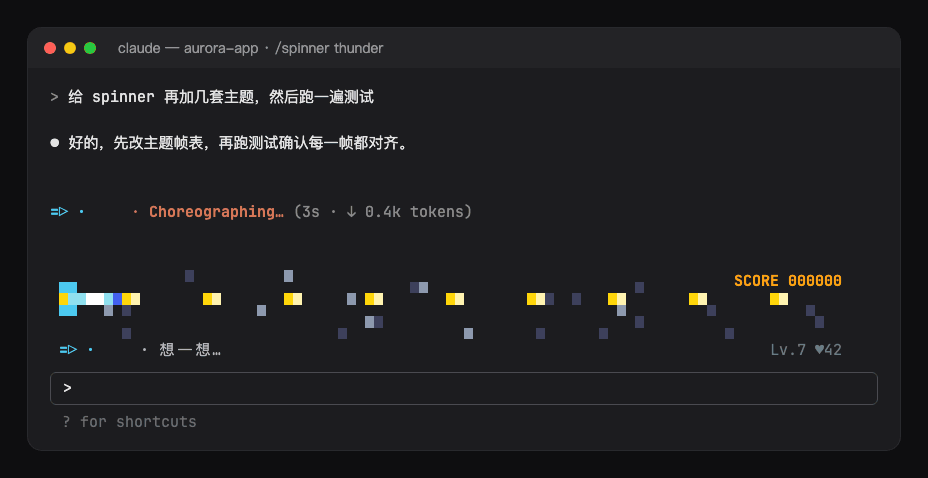 |
| `chomp` 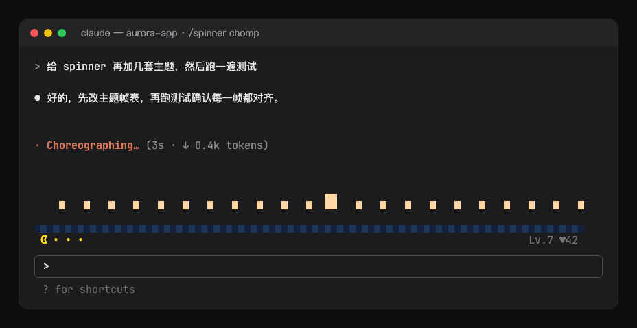 | `sparky` 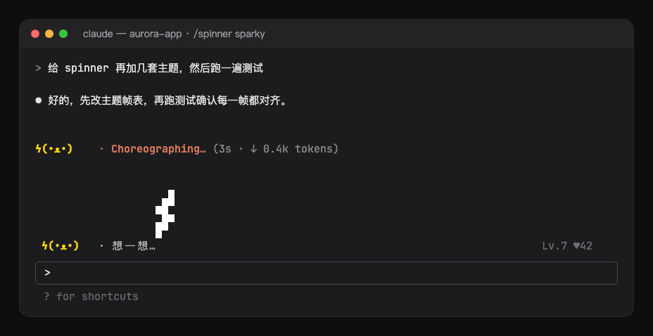 |
| `bluecat` 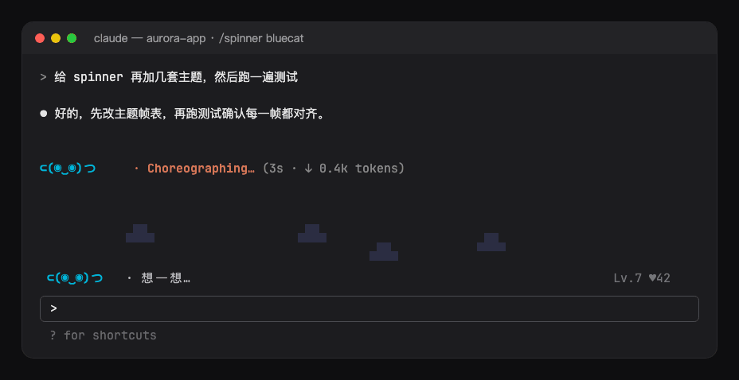 | `nyan` 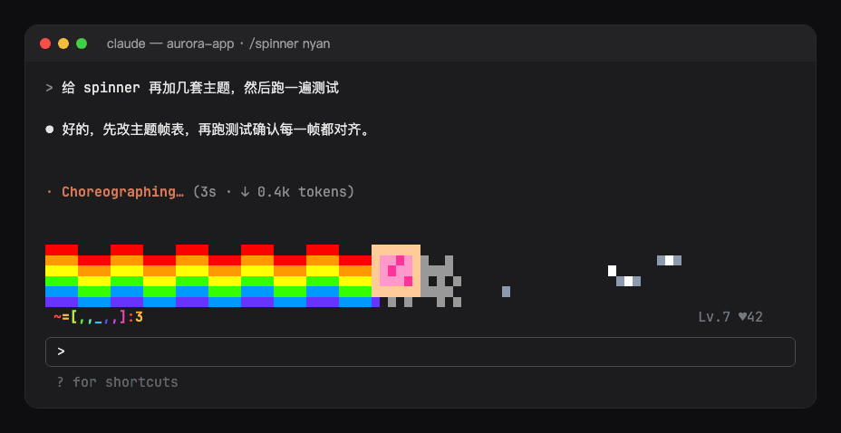 |
| `cat` 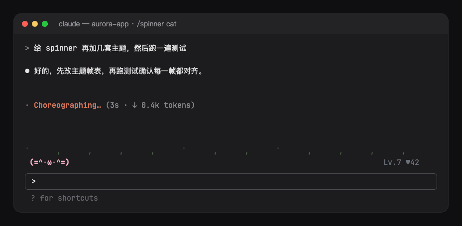 | `bunny` 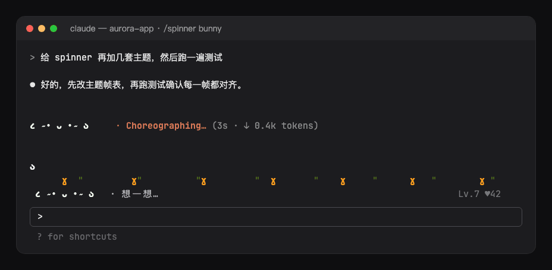 |
| `sakura` 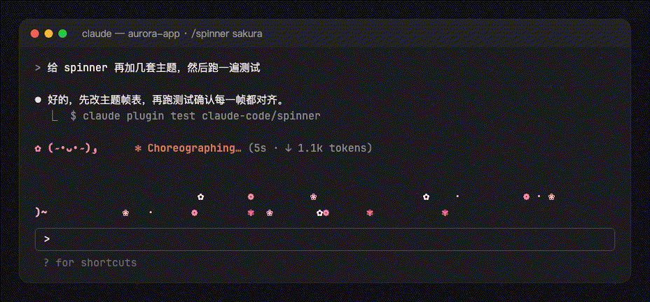 | `mecha` 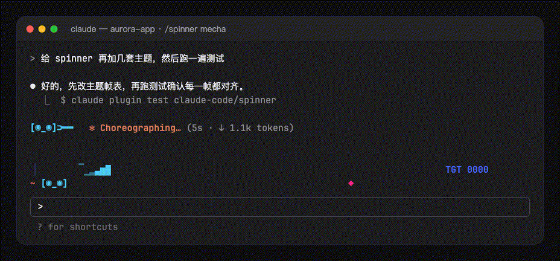 |
| `neon` 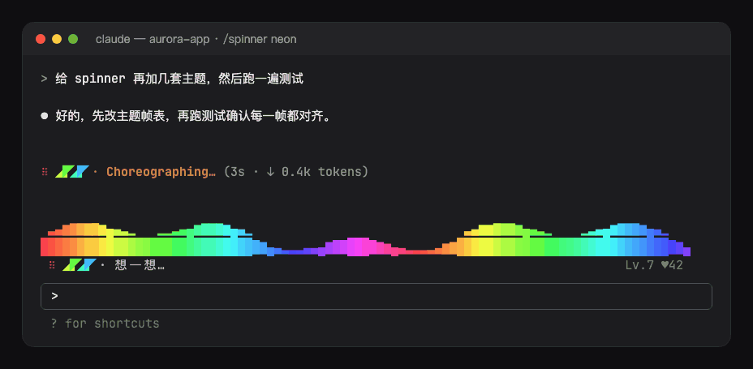 | `dino` 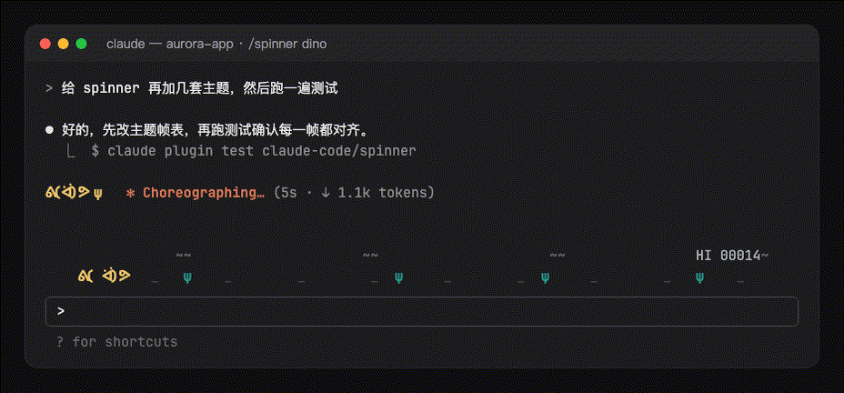 |
| `ocean` 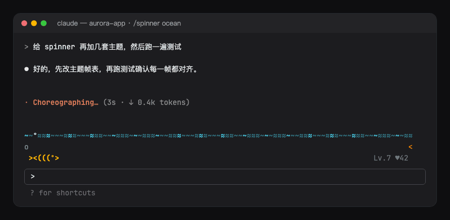 | `matrix` 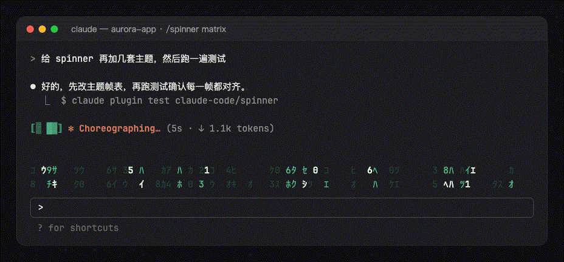 |

Every theme's mascot, stage and companion in one still: [assets/gallery.png](assets/gallery.png); a still per theme sits beside each GIF (`assets/<theme>.png`). `scripts/spinner-shots.ts` at the repository's root renders them all again from `hooks/themes.ts`.

`chomp`, `sparky`, `bluecat` and `nyan` are fan-made homages drawn from scratch, under names of their own; `clawd` is drawn as Claude Code draws him on its welcome screen.

## Commands

`/spinner` shows the theme, the companion's level and affection and the theme list; `/spinner <theme>` or `/spinner random` switches live, `/spinner theme` asks which in a dialog (random and three themes offered, any other typed under Other), `/spinner preview [theme]` plays a scene above the prompt for eight seconds, `/spinner pet` pats the companion, `/spinner off` / `on` turns everything off and on, `/spinner stage off` / `on` the scene alone, `/spinner companion off` / `on` the companion alone. What `/spinner` sets it writes to the options below (`theme`, `visible`, `stage`, `companion`), so `/config` shows it and it is kept across sessions; the change applies at once, and the mod reloads with it. A `random` theme keeps the one it drew for the session through those reloads.

## Options

- `visible`: the animations at all (default on; `/spinner off` / `on`, or the **Spinner** button in the prompt footer).
- `footerButton`: that button in the prompt footer (default on).
- `theme`: the theme (default `random`; `/spinner <theme>` sets it).
- `stage`: the animated scene above the prompt (default on).
- `celebrate`: the finale when a turn ends (default on).
- `companion`: the companion's row (default on).
- `reducedMotion`: the mascot, the scene and the companion drawn as still pictures that change with what the model does, without moving (default off).
- `language`: the language of `/spinner`'s replies, the companion's bubbles and the finale's label (`auto`, `en`, `zh-Hans`, `zh-Hant`, `ja`, `ko`, `es`, `fr`, `de`, `pt-BR`, `ru`); `auto` follows Claude Code's `language` setting, then the system locale, then English.

The band takes the theme's rows plus one for the companion while a turn runs, and one row between turns; when the band has less room, the scene steps aside and the companion stays; under three rows or 60 columns the companion takes one row: the mascot, its bubble and its level. The mascot, the stage and the companion draw on the terminal and the desktop app (the surfaces that run a `Client`); elsewhere Claude Code's own spinner shows unchanged. The pixel scenes want a terminal with true color (Ghostty, iTerm2, WezTerm, kitty).

## Layout

- `hooks/register.tsx`: the hooks: the session's start, the turn's events (activity, finale, pet), `/spinner`, the mascot on the spinner line and the band.
- `hooks/config.ts`: the options, read once into a typed `Config`.
- `hooks/command.ts`: `/spinner`'s arguments to what they ask for.
- `hooks/pet.ts`: the companion's level and bubble, tool labels, durations.
- `hooks/themes.ts`, `hooks/cells.ts`: the themes and the cell grid they draw on; `hooks/stage.tsx`, `hooks/sprite.tsx`: the `Client` modules that animate them.
- `hooks/i18n.ts`: the messages.
- `hooks/kit/`: copies of `claude-code/kit`; edit the source and run `scripts/sync-kit.sh`.
