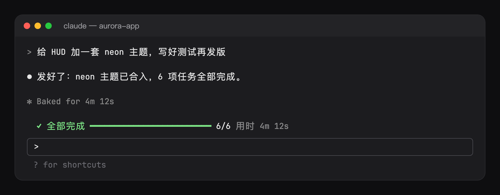

# todo-bar: a task progress bar for Claude Code

[简体中文](README.md) · **English**

Once Claude writes a task list, a progress bar appears above the prompt: the task it is on, how long that task has run, and how much of the list is done. It reads the tool calls Claude already makes, so it costs no tokens.


```
● Writing the tests   3m 12s  ━━━━━━━━──────────────────  2/7  29%
  Next: Run the build · Publish
```

## Features

- **Progress at a glance**: the running task, a bar, the count and the percentage, with the next one or two tasks in a dim second row.
- **Task timer**: once a task has run a minute its time shows after it (`3m 12s`), and turns yellow past `slowMinutes` (default 10), so a step that drags stands out.
- **Done state**: when every task is done the bar turns green with the time the whole list took, then folds away after 8 seconds; the next list brings it back.
- **No tokens, no side effects**: it reads `TodoWrite`, `TaskCreate` and `TaskUpdate` after they have run. It registers no tool, adds nothing to the system prompt and never refuses or holds a call. A refused or failed call changes nothing, and a subagent's own list is left out.
- **Survives a resume**: each session's list is kept in the plugin's store, so a resumed session finds its bar where it left it.
- The bar steps aside while a `/` or `@` picker is open.



## Install

```sh
claude plugin marketplace add hoobnn/hoobnn-agent-mods
claude plugin install todo-bar@hoobnn-agent-mods
```

## Commands

- `/todos` lists every task with its mark (`✓` done, `●` running, `○` waiting), how long it ran and the tool calls the main thread made meanwhile, e.g. `✓ Write the tests  5m 20s · tool calls: 14`.
- `/todos off` and `/todos on` hide or show the bar. They write the `visible` option, so `/config` shows the choice and later sessions keep it.

## Options

Set them in `/config`, or under `pluginConfigs` in `~/.claude/settings.json`:

| Option | What it does | Default |
| --- | --- | --- |
| `visible` | Show the bar (what `/todos off` / `on` sets) | on |
| `showNext` | A dim second row with the next one or two tasks | on |
| `slowMinutes` | Minutes after which the running task's time turns yellow; 0 never | 10 |
| `language` | `auto`, `en`, `zh-Hans`, `zh-Hant`, `ja`, `ko`, `es`, `fr`, `de`, `pt-BR`, `ru` | `auto` |

`auto` follows Claude Code's `language` setting, then the system locale (`LC_ALL`, `LC_MESSAGES`, `LANG`), then English.

## More mods

[hoobnn-agent-mods](../../README.en.md) also has a statusline HUD (`hud`), a turn receipt (`receipt`), spinner animations with a pet (`spinner`), a Tailscale node band (`ts-band`) and a Hitokoto quote band (`hitokoto`); they stack together above the prompt.

## Development

- `hooks/register.tsx`: the hooks: the session's start (language, `/todos`, a resumed board), the tool calls it reads, the command and the band.
- `hooks/board.ts`: the list as the band draws it, built from what each call carried.
- `hooks/config.ts`: the options, read once into a typed `Config`.
- `hooks/i18n.ts`: the messages.
- `hooks/kit/`: copies of `claude-code/kit` (language, option readers, band stacking, `/config` writes); edit the source and run `scripts/sync-kit.sh`.
